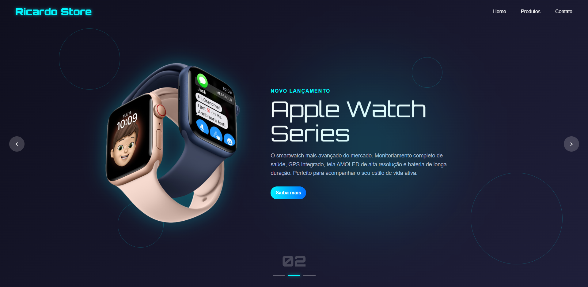

# Ricardo Store - E-commerce Landing Page

Uma landing page moderna, responsiva e de alta conversão desenvolvida para a **Ricardo Store**, destacando o novos lançamentos. O design conta com uma estética futurista baseada em um tema escuro (dark mode), elementos em neon ciano e azul, além de efeitos visuais imersivos como anéis orbitais de fundo e um carrossel interativo.

## 🚀 Tecnologias Utilizadas 

O projeto foi construído utilizando as melhores práticas de desenvolvimento web front-end:

**HTML5:** Estruturação semântica de toda a página.
**CSS3:** Estilização avançada, uso de variáveis para paleta de cores, transições suaves, animações de brilho (glow effects).
**JavaScript (ES6+):** Lógica para o carrossel de produtos (controle de slides pelas setas laterais e indicadores numéricos) e interatividade.
**Google Fonts:** Tipografia moderna que complementa o estilo tecnológico da interface.

## ✨ Funcionalidades

**Design Dark Futurista:** Paleta de cores selecionada (tons de azul escuro e detalhes em ciano/neon) para proporcionar uma experiência premium e tecnológica.
**Carrossel de Destaques:** Navegação interativa entre os principais produtos com transições fluidas e indicadores de paginação estilizados (ex: `02`).
**Chamada para Ação (CTA):** Botão "Saiba mais" projetado estrategicamente.
***Navegação Fluida:** Menu superior simplificado (`Home`, `Produtos`, `Contato`) integrado perfeitamente ao layout.

## 📦 Como Executar o Projeto

Para visualizar o projeto localmente em sua máquina, siga os passos abaixo:

clique no link abaixo 👇🏽:
https://ricardo-viniicius.github.io/landing-page-eletronicos/
